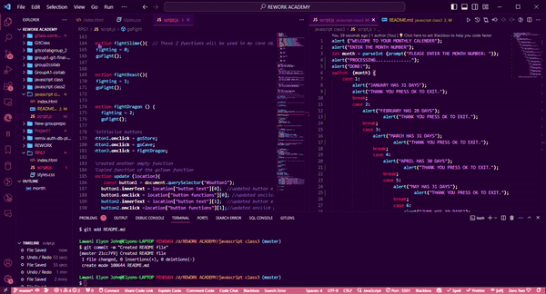
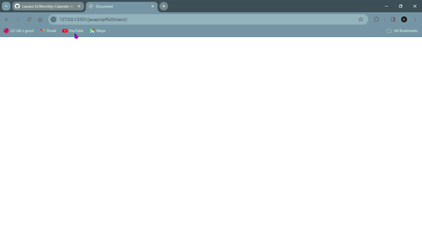

## Monthly Calendar App
Welcome to the Monthly Calendar App! This JavaScript program allows users to input a month number and receive information about the number of days in that month.

## 🎥 Screen Recordings

## How to Use
Open the script file calendar.js in your code editor or browser console.
Run the script.
You'll be prompted to enter the month number.
Based on your input, you'll receive an alert message displaying the number of days in that month.
Follow the instructions on the alerts to proceed.

## Usage Example

## Supported Months
January: 31 days
February: 28 days (not accounting for leap years)
March: 31 days
April: 30 days
May: 31 days
June: 30 days
July: 31 days
August: 31 days
September: 30 days
October: 31 days
November: 30 days
December: 31 days

